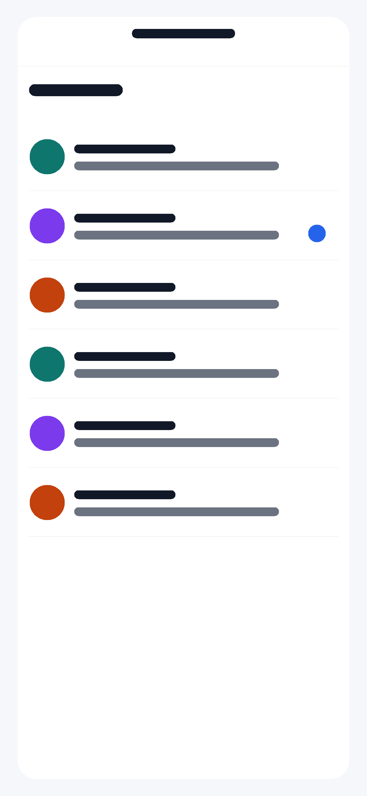
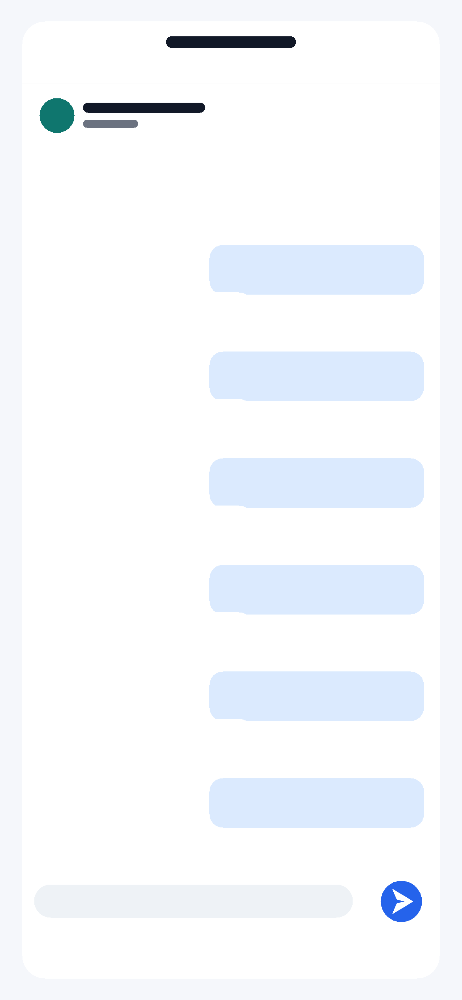

# react-native-realtime-chat

A reusable React Native real-time chat architecture showcase for startups and scalable mobile applications.

This repository demonstrates a clean, Firebase-ready chat module with reusable UI components, mock conversations, screen-level separation, service placeholders, and a scalable folder structure suitable for client review or product prototyping.

> This project intentionally uses placeholder Firebase configuration and mock data. No real API keys, client branding, or production credentials are included.

## Features

- Chat list screen with mock conversations
- Chat room screen with sent and received messages
- Reusable chat bubble, avatar, header, input, loader, empty state, and message status components
- Typing indicator placeholder
- Online and offline user status placeholder
- Timestamp formatting for conversations and messages
- Sent, delivered, and read status UI
- Firebase-ready service layer placeholder
- Push notification service placeholder
- React Navigation setup
- Context API state management
- Centralized theme colors, spacing, and typography
- Mock users, conversations, and messages
- Professional folder structure for scalable mobile apps

## Tech Stack

- React Native
- JavaScript
- React Navigation
- Context API
- Firebase-ready service structure
- Reusable component architecture

## Folder Structure

```text
src/
  assets/
    avatars/
    icons/
    images/
  components/
    Avatar/
    ChatBubble/
    ChatInput/
    EmptyState/
    Header/
    Loader/
    MessageStatus/
  constants/
  data/
  hooks/
  navigation/
  screens/
    ChatListScreen/
    ChatRoomScreen/
    UserProfileScreen/
  services/
    firebase/
    chatService.js
    notificationService.js
  store/
  theme/
  utils/
```

## Structure Notes

- `components/` contains reusable UI building blocks that can be shared across screens.
- `assets/` contains replaceable images, icons, avatars, and project visual placeholders.
- `screens/` contains feature screens and keeps business logic minimal.
- `store/` provides chat state through Context API for simple, readable state management.
- `data/` contains sample mock users, conversations, and messages.
- `services/` contains Firebase and notification placeholders for future production integration.
- `theme/` centralizes visual tokens so components avoid scattered hardcoded styling.
- `utils/` contains small formatting and user helper functions.
- `navigation/` defines the app navigation flow.

## Getting Started

Install dependencies:

```bash
npm install
```

Start Metro:

```bash
npm start
```

Run on iOS:

```bash
npm run ios
```

Run on Android:

```bash
npm run android
```

## Environment Variables

Create a local `.env` file from the sample:

```bash
cp .env.example .env
```

The included values are placeholders only:

```text
FIREBASE_API_KEY=your_firebase_api_key
FIREBASE_AUTH_DOMAIN=your_project.firebaseapp.com
FIREBASE_PROJECT_ID=your_project_id
FIREBASE_STORAGE_BUCKET=your_project.appspot.com
FIREBASE_MESSAGING_SENDER_ID=your_sender_id
FIREBASE_APP_ID=your_app_id
```

Do not commit real Firebase credentials or production secrets.

## Firebase Integration Points

The project is prepared for Firebase without requiring a live project:

- `src/services/firebase/firebaseConfig.js` contains placeholder config and initialization.
- `src/services/chatService.js` shows where Firestore conversation and message operations belong.
- `src/services/notificationService.js` shows where push notification permissions, device tokens, and deep links belong.

Suggested production integrations:

- Firebase Authentication for user sessions
- Cloud Firestore for conversations and messages
- Firebase Cloud Messaging for push notifications
- Firestore listeners for real-time message updates

## Screenshots

Mock screenshots are included as placeholders and can be replaced with simulator captures later.





## Included Assets

```text
src/assets/
  avatars/
    placeholder-avatar.png
  icons/
    send-icon.png
  images/
    chat-bg.png
    empty-chat.png

screenshots/
  chat-list.png
  chat-room.png
```

## Author
Imam Yousuf

Built as a React Native architecture showcase for real-time chat experiences.

## License

This project is available for portfolio and educational use. Add a license file before using it in production or distributing it commercially.
